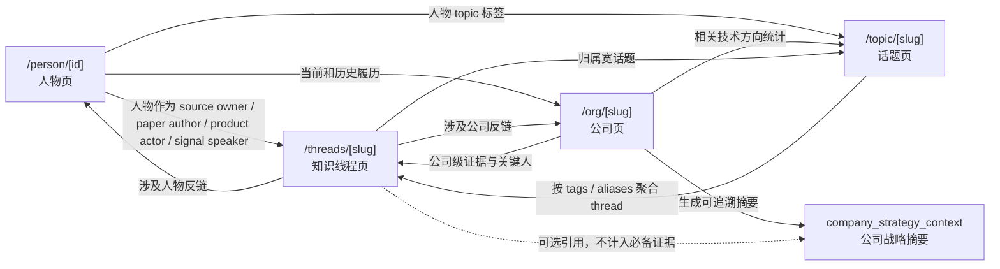

# 知识页面信息架构与互链计划

> 日期: 2026-06-18
> 任务: S7 人物页、公司页、话题页、知识线程页的信息架构和互链实验
> 输入: `docs/KNOWLEDGE_THREAD_TOPIC_PAGES_PLAN_2026_06.md`

## 1. 结论

`/person`、`/org`、`/topic`、`/threads` 应该分成四种回答方式:

| 页面 | 核心问题 | 主要证据 | 不承担的事 |
|---|---|---|---|
| `/person/[id]` 人物页 | 这个人是谁、为什么重要、和哪些组织/技术方向/人物有关 | 人物档案、履历、论文、项目、动态、关系证据 | 不把单个人的 X 信号升级成知识主题结论 |
| `/org/[slug]` 公司页 | 这家公司或机构在 AI 领域做什么、有哪些关键人、战略和投入指向哪里 | 公司官网、产品文档、博客、changelog、财报/IR/earnings call、团队和履历数据 | 不替技术主题页证明概念定义 |
| `/topic/[slug]` 话题页 | 某个宽泛方向里谁值得看、最近有什么动态、有哪些相邻方向 | 人物标签、近期动态、作品、相关机构 | 不做深度证据图谱，也不要求覆盖官方/论文/字幕五类来源 |
| `/threads/[slug]` 知识线程页 | 一个可策展的前沿概念是什么、证据链如何互相印证、下一步该读什么 | X signal、官方定义、字幕长解释、论文根基、工程实现、可选公司战略摘要 | 不把财报作为技术主题页达标证据 |

产品上要让用户先从熟悉的人物、公司、宽话题进入，再被引到更窄、更有证据结构的知识线程。这样 `/threads/loop-engineering` 这种页面不会变成孤岛。

## 2. 页面关系

## 3. 四类页面职责

### `/person/[id]`

人物页回答的是“这个人在 AI 生态里为什么值得关注”。页面应该继续以个人档案、履历、关系、论文/项目和动态为主。

新增知识线程入口时，只展示和这个人有明确关系的 thread:

| 关系 | 展示条件 | 文案方向 |
|---|---|---|
| `signal_speaker` | 这个人的 X、访谈、播客或公开发言被 thread 用作 signal | “他/她的观点出现在这些知识线程里” |
| `source_author` | 这个人是论文、博客、代码或官方材料作者之一 | “他/她参与的材料支撑了这些知识线程” |
| `product_actor` | 这个人所属产品、团队或项目是 thread 的产品化案例 | “相关产品线正在把这些概念落地” |
| `subject_person` | thread 直接讨论这个人的方法、观点或工作流 | “围绕他/她工作的深度主题” |

人物页不直接显示 thread 的全部证据图谱。入口只需要 title、summary、evidence role chips、最近更新时间和可信度，点击后进 `/threads/[slug]`。

### `/org/[slug]`

公司页回答的是“这家公司在 AI 里怎么布局，谁在里面，哪些方向最活跃”。这里可以容纳公司级证据，包括财报、IR、earnings call、产品发布、组织调整和招聘信号。

公司页和 thread 的关系分两层:

| 关系 | 说明 | 页面位置 |
|---|---|---|
| org -> thread | thread 引用了该公司的官方博客、docs、changelog、产品发布、工程实现或关键人物材料 | 侧栏“相关知识线程” |
| org -> topic | 该公司相关人物、动态和作品聚合出的宽话题 | 现有“相关话题”继续保留 |
| org -> company_strategy_context | 公司页基于公司级证据生成一段可追溯战略摘要 | 公司页独立模块，thread 可选引用 |

`company_strategy_context` 的建议字段:

| 字段 | 用途 |
|---|---|
| `organizationSlug` | 绑定公司页 |
| `summary` | 3 到 5 句战略摘要 |
| `sourceIds` | 官网、财报、IR、earnings call、changelog 等来源 |
| `validFrom` / `validTo` | 防止旧战略被长期误用 |
| `confidence` | 公司级判断置信度 |
| `linkedThreadSlugs` | 可选关联到哪些 thread |

thread 引用它时只能作为背景旁证，例如“Anthropic 对 coding agent 的投入可从公司战略摘要看到”。它不能替代 thread 的 `official_definition`、`paper_foundation`、`implementation_signal` 等必备来源。

### `/topic/[slug]`

话题页回答的是“这个宽方向下有哪些人、机构、动态和作品”。它现在已经承担了目录和聚合任务，后续不要让它变成第二套知识主题页。

新增 thread 聚合时，topic 页只做轻量分发:

| 聚合依据 | 规则 |
|---|---|
| `KnowledgeThread.tags` | 和 topic canonical label 或 alias 命中 |
| `KnowledgeThread.category` | category 映射到宽话题，例如 `agentic-coding` 归入 `Agent` |
| `KnowledgeThreadSource` | source 关联的人物或组织大量落在该 topic |
| 手工 pin | 黄金样板或高价值 thread 可在 topic 页置顶 |

topic 页展示 thread 时，应强调“深度知识线程”，避免用户误解它和现有人物目录是同一类内容。推荐卡片字段: title、summary、required role coverage、lastReviewedAt、sourceCount、primary related orgs。

### `/threads/[slug]`

知识线程页回答的是“一个具体概念到底是什么、证据链怎么成立”。它必须比 topic 窄，比人物页和公司页更重证据结构。

必备模块延续原计划:

| 模块 | 证据要求 |
|---|---|
| 首屏判断 | 概念定义、为什么现在重要、可信度、更新时间 |
| 证据地图 | 至少覆盖 signal、official_definition、transcript_context、paper_foundation、implementation_signal |
| 关键时间线 | 每个节点有来源 |
| 官方定义 | 官方博客、docs、changelog 优先 |
| 产品化路径 | 官方或产品来源优先 |
| 人物信号 | 只作为新鲜度和观点入口 |
| 深度解释 | 字幕、逐字稿或可靠转写 |
| 论文根基 | 说明论文和主题的关联方式 |
| 工程实现 | GitHub、examples、docs snippets |
| 公司策略回链 | 可选引用公司页摘要，不能作为达标项 |

## 4. 互链规则

### 人物页反链 thread

触发条件:

1. `KnowledgeThreadSource.rawPoolItemId` 指向该人物的 RawPoolItem。
2. `KnowledgeThreadSource.metadata.personIds` 包含该人物。
3. `KnowledgeThreadEdge` 的 evidenceNote 提到该人物是 source author、speaker、paper author 或 product actor。
4. 人物的 `topics` 和 thread 的 `tags` 命中时，只能作为候选，不能单独展示为强反链。

排序规则:

1. `subject_person` 和 `source_author` 优先。
2. `official_definition`、`paper_foundation`、`implementation_signal` 权重大于单条 X signal。
3. `lastReviewedAt` 新的优先。
4. 每个人物页首屏最多展示 3 个 thread，更多进独立列表或 tab。

### 公司页反链 thread/topic

公司页 thread 入口分三类:

| 类型 | 触发条件 | 权重 |
|---|---|---|
| 公司官方材料被 thread 引用 | sourceOwner 或 url domain 绑定该公司，role 属于 official/product/implementation | 高 |
| 公司关键人物参与 thread | thread source 绑定该公司人物，且人物在公司页当前或历史履历里 | 中 |
| 公司策略摘要被 thread 引用 | thread 显式引用 `company_strategy_context` | 中，必须标成背景 |

公司页 topic 入口继续来自相关人物的 topic 分布，不从财报或 IR 直接推技术 topic。财报可以说明公司投入和优先级，但不能自动证明一个技术主题成立。

### topic 页聚合 thread

topic 页聚合的目标是“帮用户发现更窄的知识线程”。P0 可以只做静态或 fixture 列表，P1 再接数据层。

聚合规则:

1. thread 的 `tags` 或 `aliases` 命中 topic alias。
2. thread 的 required role coverage 已达到 `review_ready` 或 `published`。
3. 同一 topic 下优先展示证据覆盖完整的 thread，thin thread 只在“待补证据”区展示。
4. 用户从 topic 点击 thread 后，thread 页要回链当前 topic，保留“宽方向 -> 深线程”的路径感。

### thread 引用 company_strategy_context

thread 可以引用公司页摘要，但要满足四条:

1. 引用对象必须有 `sourceIds`，不能引用无来源总结。
2. 页面上标成“公司战略背景”，不混入技术证据地图的必备来源计数。
3. 引用处回链 `/org/[slug]`，让用户能查公司级证据。
4. 摘要过期或置信度低时，thread 只显示回链，不把它写进强判断。

## 5. 最小导航和入口实验

P0 导航目标不是重做全站导航，而是让用户知道知识线程存在，并能从已有页面自然进入。

建议实验顺序:

| 顺序 | 入口 | 做法 | 成功信号 |
|---|---|---|---|
| 1 | `/topic/[slug]` 侧栏 | 在“相关话题”附近加 “深度知识线程” 模块，先展示 2 到 4 个匹配 thread | 用户从 topic 进入 thread |
| 2 | `/org/[slug]` 侧栏 | 在“相关话题”附近加 “相关知识线程”，展示官方材料或关键人物关联的 thread | 用户从公司页理解公司级证据和技术线程的关系 |
| 3 | `/person/[id]` topics 区 | 在 topic tab 或主题卡附近加 “相关知识线程” 小模块 | 用户从人进入概念，不只停在人名资料 |
| 4 | 首页或 digest | 加一个低打扰入口“知识线程”，只放已 published 或黄金样板 | 用户知道这是一个独立产品区 |
| 5 | `/threads/[slug]` 页内回链 | 每个 thread 回链涉及人物、公司和宽 topic | 用户能回到熟悉目录继续探索 |

这轮 S7 不直接改导航代码。S3 正在负责 `/threads/[slug]` 页面模板，S5 可能会动 fixture 或数据读取。现在先把规则固化，等页面和数据层稳定后再做最小入口补丁，冲突会少很多。

## 6. 数据和来源边界

公司级证据和技术主题证据要分开:

| 证据类型 | 归属 | 能证明什么 | 不能证明什么 |
|---|---|---|---|
| 财报、IR、earnings call、SEC filing | 公司页 | 战略重点、资本开支、业务优先级、管理层说法 | 技术概念定义、论文方法成立、产品工程实现 |
| 官方博客、docs、changelog | 公司页和 thread 都可用 | 产品定义、功能边界、发布事实 | 单独证明学术根基 |
| X / 推文 | 人物页和 thread signal | 新鲜信号、人物观点、术语冒头 | 最终事实和官方定义 |
| YouTube / podcast 字幕 | 人物页和 thread | 长解释、动机、工作流细节 | 无字幕时不做强判断 |
| 论文 | 人物页和 thread | 方法根基、评测、技术约束 | 公司战略 |
| GitHub / examples | thread 和人物页 | 工程落地、开发者采用 | 公司财务投入 |

## 7. P0 交付建议

1. S3 先做 `/threads/loop-engineering` 黄金样板。
2. S7 的互链先以 fixture schema 表达，不写生产数据。
3. topic/org/person 页面先等 thread 页面存在后再接入口。
4. `company_strategy_context` 先在文档和 fixture 里定义字段，不急着落 Prisma migration。
5. 财报和 IR 只进入公司页证据层，thread 页只接受可追溯摘要回链。

## 8. 验证口径

本次只新增文档，不改代码、不改生产数据、不触碰 xAI/X Search 相关文件。验证方式:

1. 回读 `docs/KNOWLEDGE_NAV_AND_LINKING_PLAN_2026_06.md`。
2. `git diff -- docs/KNOWLEDGE_NAV_AND_LINKING_PLAN_2026_06.md` 确认只新增 S7 文档。
3. 因为没有代码改动，不需要跑 `pnpm lint` 和 `pnpm build`。
