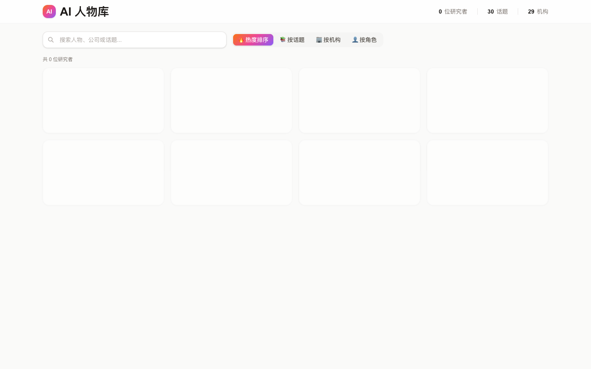
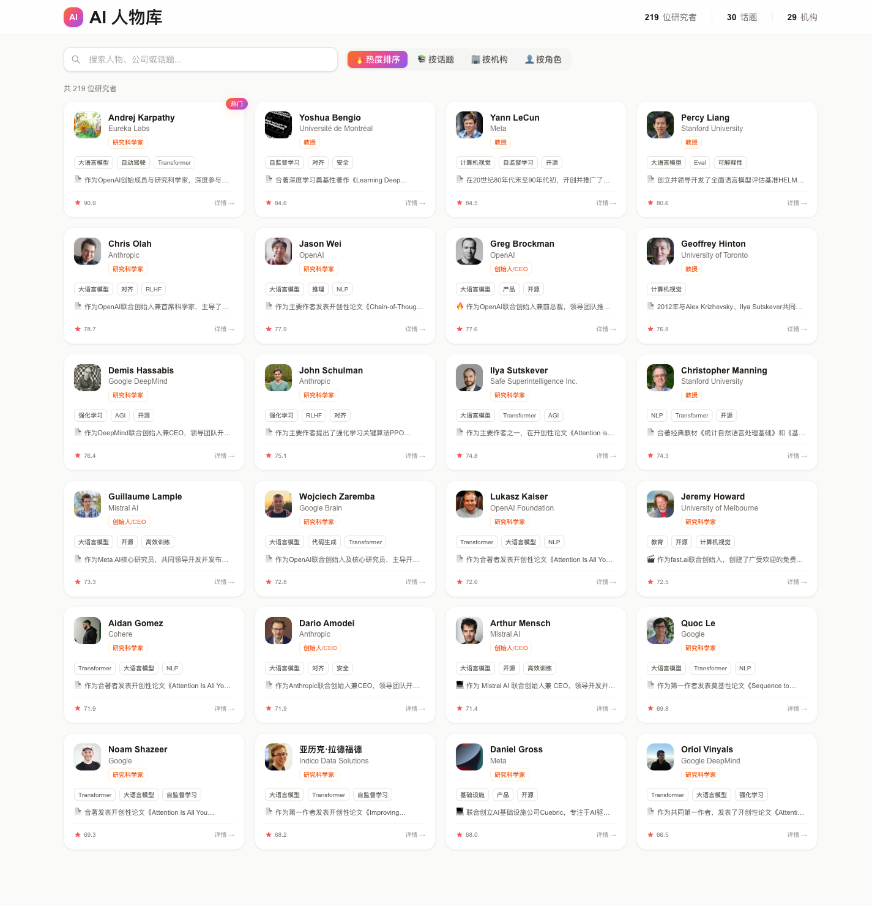
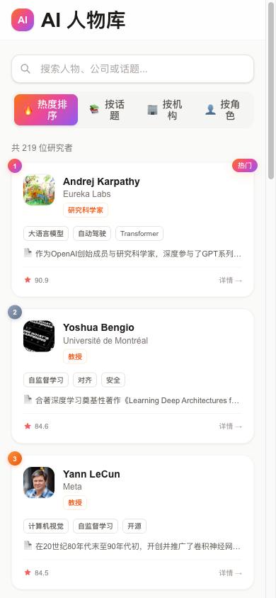
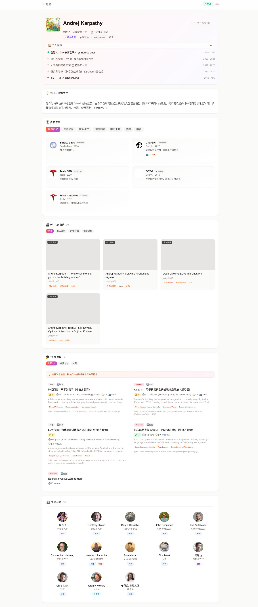

# AI 人物库 · 产品审计与升级路线图

> 审计日期: 2026-06-07
> 审计人: Claude (基于线上实测 + 代码走查)
> 线上环境: https://people.llmxy.xyz (Aliyun FC 反代 + Vercel + Neon Postgres)
> 数据规模: 219 人物 / 30 话题 / 30 机构 (上次文档记录 144 人,中间有增量)
> 本文档为单一事实来源,整合: 产品体验审计 + 名册重盘 + 技术债 + 清洗聚合优化

---

## 0. 执行摘要 (TL;DR)

线上**功能是正常的**(219 人物数据完整、详情页内容丰富),但存在 **1 个可用性 P0、1 个品牌 P0**,以及一批数据质量与体验问题。核心结论:

1. **冷启动白屏**(P0): Neon 闲置暂停,真实用户首访看到"0 研究者 + 空骨架屏"持续数秒。**最伤体验,最该先修,且不依赖任何大重构。**
2. **"OpenAI基金会"全库错译**(P0): 所有 OpenAI 显示为"OpenAI基金会",品牌名翻译事故,全库污染。**批量 SQL 即可快速修。**
3. **数据质量债**(P1): 实习日期错误、关联人物关系疑似 LLM 编造、influenceScore 排序口径陈旧。需清洗/聚合 pipeline 升级解决。
4. **名册该重盘**(P1): 半年未系统更新,缺 2025-2026 新晋人物,职位现状漂移,热度需重算。
5. **技术债**(P1): 159 个脚本失控、LLM 调用无统一抽象、清洗全靠关键词规则。

> 行动策略: **P0 两项立即单独修(快速见效)** → 同时推进 **LLM 抽象层 + 清洗聚合升级(地基)** → 再用升级后 pipeline **全量重盘名册**。

---

## 1. 线上产品审计 (实测发现)

### 1.1 列表页 (首页)

#### 🔴 P0-1 冷启动白屏 (可用性)
- **现象**: 首次访问显示 `0 位研究者` + 一排空骨架卡片,持续数秒后才加载出 219 人。
  
  
- **根因**:
  1. Neon 免费版闲置自动暂停,冷启动需数秒唤醒,首个 DB 查询超时。
  2. 头部人数 SSR 渲染为 `0`,`共 0 位研究者`,靠客户端 SWR 二次 fetch 才更新;冷库时这个 0 态长时间可见。
- **影响**: 真实用户(尤其低频访问)首屏体验 = 空库,可信度崩塌。

#### 体验问题
- 🟡 P2: 移动端筛选 pill 文字折行 — "热度排序"被挤成"热度排/序",四个 tab(热度排序/按话题/按机构/按角色)全折行,观感差。
  
- 🟢 卡片设计本身干净: 排名徽章(1/2/3)、头像、姓名、机构、角色标签、话题 tag、高亮摘要、热度分、详情入口,信息层级清晰。

### 1.2 详情页 (以 Andrej Karpathy 为例)

页面结构丰富且合理: 履历时间线 / 为什么值得关注 / 代表作品(代表产品·开源项目·核心论文·话题贡献·学习卡片·博客·播客 7 个 Tab) / 听 TA 亲自讲(视频) / TA 的课程 / 关联人物。**信息架构是这个产品的强项。**

但暴露多个数据质量问题:

#### 🔴 P0-2 "OpenAI基金会" 全库错译 (品牌)
- **现象**: 履历"研究科学家 @ OpenAI基金会"、关联人物 John Schulman/Ilya Sutskever/Wojciech Zaremba 机构全显示"OpenAI基金会";列表 API 也返回 `organization: ["OpenAI基金会","特斯拉公司","OpenAI基金会"]`(还重复)。
- **根因**: "OpenAI Foundation" 机翻直译入库,污染全库所有 OpenAI 关联记录。"特斯拉公司"(Tesla, Inc.)同理。
- **影响**: OpenAI 是知名品牌,错译像翻译事故;219 人中凡在 OpenAI 待过者全部中招。

#### 🟠 P1-1 实习经历日期错误
- **现象**: "实习生 @ ... 2015 - now" — 实习结束时间显示"现在"。
- **根因**: `DATA_QUALITY_ISSUES.md` P2#10 已记录(endDate=startDate 或缺失),至今未修。

#### 🟠 P1-2 关联人物关系疑似 LLM 编造 (需核实)
- **现象**: Karpathy 页面将 Demis Hassabis 标为"同事 @ 伦敦大学学院"、Geoffrey Hinton 标为"同事"。这些与 Karpathy 实际无对应共事关系。
- **根因**: 关联人物关系由 LLM 生成(`enrich_relations_ai.ts` / `enrich_mentioned_people.ts`),缺校验,典型幻觉。
- **风险**: 关系图谱是详情页亮点,若大量关系不可信,直接损害产品专业度。**需抽样核实关系准确率。**

#### 🟡 P2 其他
- 产品 logo 破图: eurekalabs.ai 等取 Google favicon 返回 404(console 报错),代表作品卡片显示破图。
- 视频缩略图部分空白(灰块) — YouTube 数据问题延续。
- 履历重复: 同一 OpenAI 记录因机构重复(见 §2)可能重复展示。

### 1.3 影响力排序口径 (🟠 P1-3)
- **现象**: 热度榜前三 Karpathy(90.9)/Bengio(84.6)/LeCun(84.5),明显学术权重导向。
- **问题**: 2026 年产品视角下,Sam Altman、黄仁勋、Dario Amodei 等产业领袖排名可能失真。`influenceScore` 口径需结合当下产业影响力重新校准。

---

## 2. 数据质量问题汇总 (线上实证 + 历史报告)

`DATA_QUALITY_ISSUES.md`(2026-01 扫描)所列问题,本次线上实测验证修复情况:

| 问题 | 历史报告 | 2026-06 线上实测 | 状态 |
|------|---------|-----------------|------|
| Karpathy 缺 2016 OpenAI 履历 | P0#1 | 已显示"研究科学家(联合创始成员)2016-2017" | ✅ 已修 |
| 组织重复(Google/OpenAI 多条) | P1#6 | `["OpenAI基金会","特斯拉公司","OpenAI基金会"]` 仍重复 | ❌ 未修 |
| 实习日期精度(endDate=now) | P2#10 | "实习生 2015-now" 仍在 | ❌ 未修 |
| 机构名错译"OpenAI基金会" | 未记录 | 全库污染 | ❌ 新增问题 |
| 关联人物关系幻觉 | 未记录 | Hassabis/Hinton 误标同事 | ❌ 新增问题 |
| YouTube 缩略图/分类 | P0#4/P2#8 | 部分缩略图空白 | ⚠️ 部分 |

**结论**: 履历补全做了,但**机构规范化、去重、关系校验、翻译质量**这几项系统性问题未解决,且随数据增长(144→219)在放大。

---

## 3. 人物名册重盘

库内 219 人,但半年未系统更新。三项工作:

### 3.1 补新人 (覆盖率)
- 现有库偏"老牌学术大佬",需补 2025-2026 新晋关键人物:
  - 各家新任/变动 CEO、核心研究负责人
  - Agent / 具身智能 / 世界模型 / 推理模型方向的新锐研究者
  - 爆火 AI 创业者
- 方法: 维护一份"待补人物"种子清单,走 `add_priority_ai_people.ts` 入库 → 升级后 pipeline enrich。

### 3.2 重抓现状 (准确性)
- AI 圈职位变动极频繁(跳槽/创业/回归)。库内"Eureka Labs 2024-now"等记录需逐人重新核实。
- ⚠️ 教训: 本次测试中转站 grok 时,它声称"Karpathy 加入 Anthropic"(已判定为幻觉)。**现状必须从权威源重抓核实,不能靠 LLM 记忆。**
- 方法: 全量重跑 `recrawl_robust.ts` + Wikidata/官方源校验。

### 3.3 重算 influenceScore (排序)
- 现口径偏学术,需纳入产业影响力维度(公司体量、产品影响、近期声量)。
- 方法: 重新定义 `qualityScore.ts` / influenceScore 算法,全量重算。

---

## 4. 技术债 (详见 docs/UPGRADE_PLAN.md)

线上问题的代码根源,按优先级:

| # | 改造项 | 优先级 | 与本审计的关系 |
|---|--------|--------|---------------|
| 1 | **LLM Provider 统一抽象层** (provider.ts) | P0 | 名册重盘 + 清洗升级的地基;接入已验证的 gemini/grok 新 key |
| 2 | 数据抓取 pipeline 升级 (grok 模型 + 校验闸) | P0 | 重抓现状(§3.2)依赖此 |
| 3 | scripts/ 治理 (159 个脚本归档) | P0 | 无依赖,可立即做 |
| 4 | 数据质量债清理 | P1 | 对应 §2 全部问题 |
| 5 | Prisma 6 + JSON 字段规范化 | P1 | organization 等字段规范化 |
| 6 | 依赖大版本升级回归验证 | P1 | 最近 commit 刚升级,build 未验证 |

> **新 key 已验证可用**(中转站 `jiuuij.de5.net/v1`): gemini-3-flash-preview(清洗主力) + grok-4.3-medium(抓 X,带 handle 校验闸)。详见 UPGRADE_PLAN.md。

---

## 5. 清洗 & 聚合优化 (详见 docs/CLEANING_AGGREGATION_OPTIMIZATION.md)

本次审计的 §1.2/§2 数据问题,根源在清洗聚合逻辑:

- **清洗=纯关键词规则,门槛失效**: `isAIRelevant` 含 `'ai'` 子串(命中 rain/email),`isAboutPerson` org 子串匹配("google"即算关于此人) → 抓错人、收脏数据。
- **聚合=无序截断+精确去重**: 卡片输入 `slice(0,10)` 无排序,去重靠精确标题/hash → 重复累积、关系幻觉无校验。
- **方案**: 三段式清洗(规则预过滤 → gemini 语义判定 → 模糊去重)+ 有序重聚合 + QA 审计落库。

---

## 6. 统一优先级路线图

### 🚀 第一波: 快速见效 (不依赖大重构,1-2 天)
独立修两个最伤体验的 P0:

| 任务 | 做法 | 工作量 |
|------|------|--------|
| **修冷启动白屏** | ① 骨架屏改"加载中"友好态 + 失败重试;② Neon 加预热(cron ping)或评估升级付费档;③ 头部计数加 SSR 容错,不注水 0 | 0.5d |
| **修"OpenAI基金会"错译** | 批量 SQL/脚本: 全库 organization/PersonRole/关联人物机构名标准化("OpenAI基金会"→"OpenAI","特斯拉公司"→"特斯拉"),复用 ORG_ALIASES | 0.5d |
| **修实习日期** | 脚本: endDate=startDate 或 实习 role 的 endDate=now → 置 null | 0.5d |
| **scripts/ 治理** | 159 脚本归档,保留可复用 pipeline | 0.5d |

### 🏗 第二波: 地基 (清洗聚合核心,3-5 天)
| 任务 | 依赖 |
|------|------|
| LLM 抽象层 provider.ts(接 gemini/grok) | — |
| 语义清洗层 semantic-qa.ts + 模糊去重 dedup.ts + QAAuditLog | provider.ts |
| 关联人物关系校验(修 P1-2 幻觉) | provider.ts |
| A/B 验证: 5-10 个已知脏数据人物对比新旧清洗误收误拒率 | 上述 |

### 🔄 第三波: 名册重盘 (用升级后 pipeline,2-3 天)
| 任务 | 依赖 |
|------|------|
| 补 2025-2026 新晋人物(种子清单) | 第二波 |
| 全量重抓现状 + 权威源校验 | 第二波 + grok 抓取升级 |
| 重算 influenceScore | qualityScore 改造 |
| 全量重洗 + 重聚合(带 --dry-run) | 第二波 |

### 📐 第四波: 收尾
- Prisma 6 升级 + JSON 字段规范化
- 移动端 pill 折行、favicon 破图等 P2 打磨
- Router 反馈闭环 + career 规范化合并

---

## 7. 关联文档
- `docs/UPGRADE_PLAN.md` — 6 项技术债改造详情 + 中转站 key 验证结果
- `docs/CLEANING_AGGREGATION_OPTIMIZATION.md` — 清洗聚合三段式方案 + 成本估算
- `DATA_QUALITY_ISSUES.md` — 2026-01 历史数据质量扫描(本文档 §2 已交叉验证)
- `docs/audit-2026-06/screenshots/` — 本次线上实测截图证据
